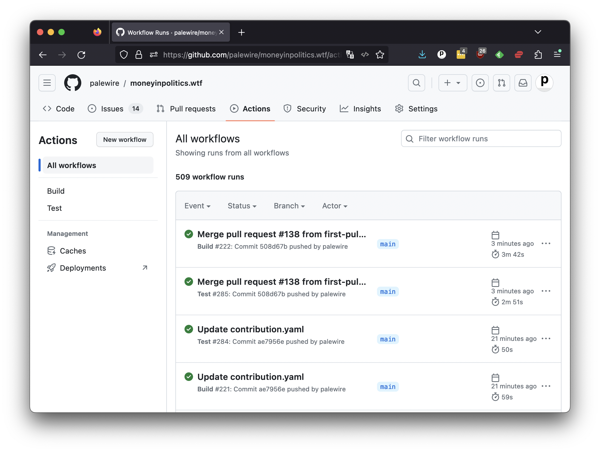

```{include} _templates/nav.html
```

# Actions

Once your commit is merged into the original repository, that will trigger an update to the cummings.ee website via GitHub Actions.

With GitHub Actions, users can create custom, automated steps in their workflow that can be triggered by specific events, such as when a code change is pushed to a repository or when a pull request is opened. This allows developers to automate tasks such as building and testing their code, deploying their applications, and running other processes related to their projects. 

You can see a repository's workflows by clicking the Actions tab in the middle of the page. There you'll find a list of the latest events.



In this case, you should see that a build routine triggered by your pull request has finished successfully. That means we should expect to see your poem live on the website.
