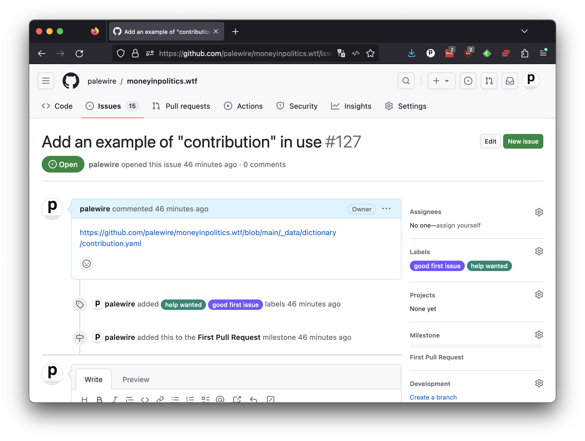

```{include} _templates/nav.html
```

# Commits

Once you're confident in your transcription, the next step is to save your work using another version control technique: the commit.

A code commit is a log that records changes made to a repository. It marks a point in time at which the code is saved, along with a description of the changes that were made.

In the github.dev interface, you can do this by clicking on the source control icon with a blue notification bubble on the left hand panel.


In the form that appears, your should enter a brief message into the text box that describes your changes. This will be logged into the repository with the commit. While it's not required, it is considered good form to include the number printed at the top of your issue's page.

[](https://github.com/palewire/cummings.ee/issues/179)

In the case of this example, a reasonable commit message could read:

```
Transcription of "if being moticed with a dream." Fixes #179
```

Draft something similar, customized to fit your poem and issue number. Then enter it into the form's box and press the green "Commit & Push" button below. You should see a popup box.


Because you are not an owner of the cummings.ee repository, you do not have permission to save your commits without the approval of the project's maintainers. That's where GitHub's forking system comes in. Click the green "Fork respository" button and advance to the next chapter.
