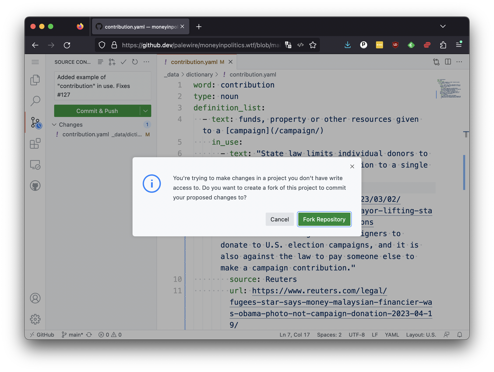
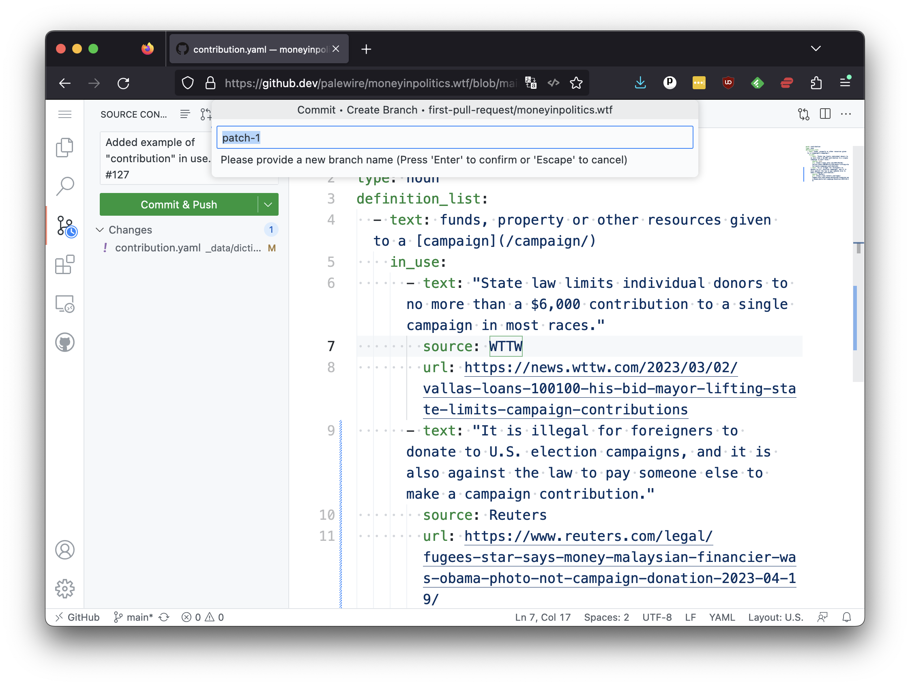

# Commits

Once you're confident in your transcription, the next step is to save your work using another version control technique: the commit.

A code commit is a log that records changes made to a repository. It marks a point in time at which the code is saved, including a description of what was changed.

In the github.dev interface, you can do this by clicking on the source control icon with a blue notification bubble on the left-hand panel.


In the form that appears, your should enter a brief message into the text input describing your changes. This will be logged into the repository with the commit. While it's not required, it is considered good form to include the number printed at the top of your issue's page. This will link your code commit with the issue tracker.

[](https://github.com/palewire/cummings.ee/issues/179)

In the case of this example, a reasonable commit message could read:

```
Added example of "contribution" in use. Fixes #127
```

Draft something similar, customized to fit your definition and issue number. Then enter it into the form's box and press the green "Commit & Push" button below. You should see a popup box.



Because you are not an owner of the moneyinpolitics.wtf repository, you do not have permission to save your commits without the approval of the project's maintainers. That's where GitHub's forking system comes in. Click the green "Fork respository" button.

A small box will appear asking you to enter a name. Accept the default value, which should be something like `patch-1`.



Finally, it will ask you if you want to "switch" to your forked repository. Hit the green button.


Once the page reloads, you should hit the menu button in the upper left and select the "Go to repository" option at the bottom of the pulldown.

