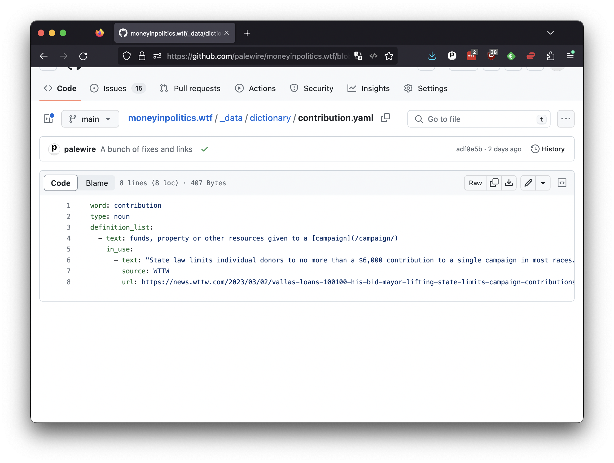
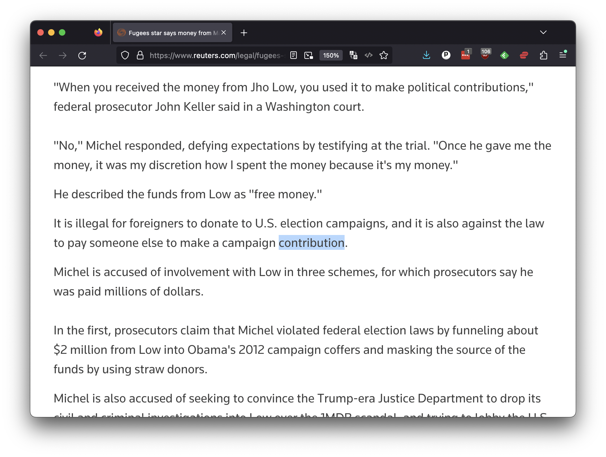
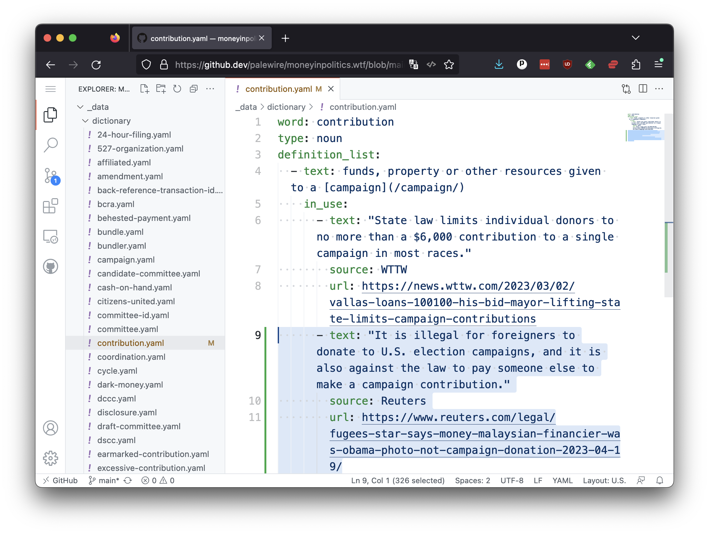

# Edits

When you arrive on the YAML page, you should see that the `is_use` attribute on the first defintion contains only a single entry.



To begin editing, click the down arrow next to the pencil-shaped icon at the upper right of the file. Select "open in github.dev" from the pulldown menu that appears.


That will open a new panel where you are free to start revising the repository's code in GitHub's web editor, which allows you to work from your web browser.


```{note}
 While most computer programmers prefer to download the repository's source code and use a text editor installed on their own computer, GitHub's web editor is a great way to experiment and get started.
```

Visit [Google News](https://news.google.com/) and search for the definition you are editing. Look for examples of the word used by a reputable media organization in a way that fits the definition.

In our demonstration case, we are editing the word "contribution." I found an example in [a story](https://www.reuters.com/legal/fugees-star-says-money-malaysian-financier-was-obama-photo-not-campaign-donation-2023-04-19/) published by Reuters, the world's largest independent news organization.

[](https://www.reuters.com/legal/fugees-star-says-money-malaysian-financier-was-obama-photo-not-campaign-donation-2023-04-19/)

When you find an example for your definition, you should create a new YAML item. It should contain a `text` attribute with the sentence containing the word, the name of the `source` publication and a `url` attribute with the link to the story.

```yaml
- text: "It is illegal for foreigners to donate to U.S. election campaigns, and it is also against the law to pay someone else to make a campaign contribution."
  source: Reuters
  url: https://www.reuters.com/legal/fugees-star-says-money-malaysian-financier-was-obama-photo-not-campaign-donation-2023-04-19/
```

That code snippet should be added to the `definition_list` attribute, which is a list of all the definitions for the word. It will need to be indented six spaces to be nested under the `definition_list` entry you're illustrating.



It's important to indent the properly. The code will not work if it is not indented correctly. Take a look at the other definitions in the file to see how they are nested and try to match that.