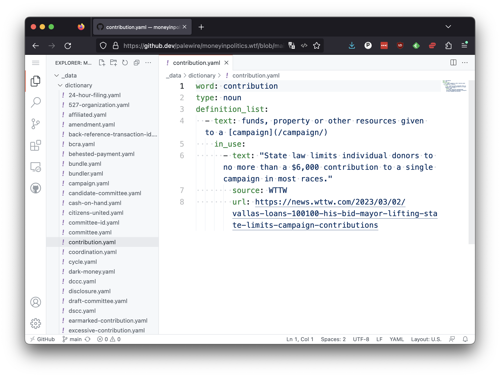
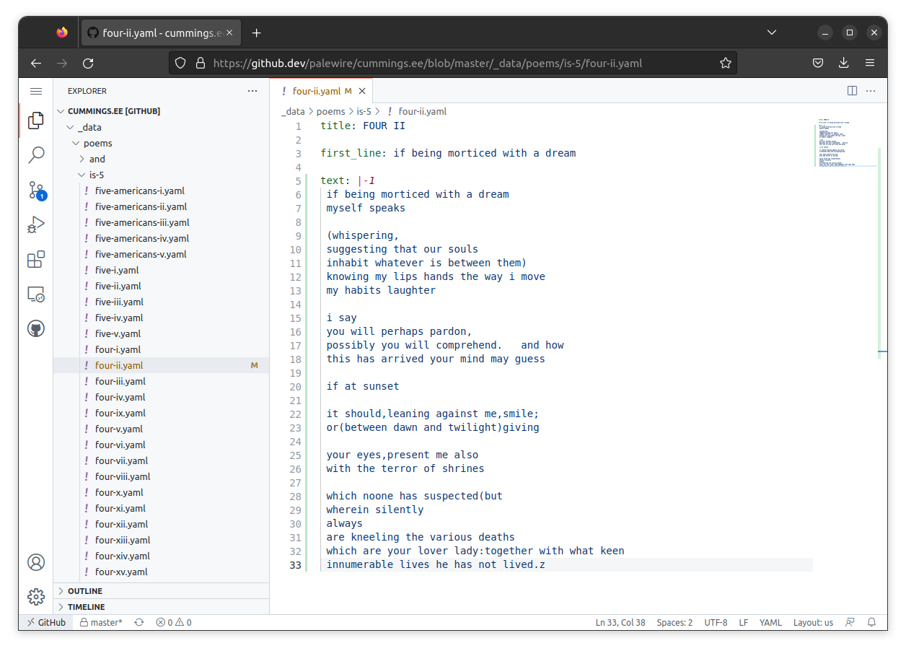

```{include} _templates/nav.html
```

# Edits

When you arrive on the YAML page, you should see that the `text` attribute we saw earlier is absent. That confirms that poems has yet to be transcribed.


To begin editing the file, click the down arrow next to pencil shaped icon and select "open in github.dev" from the pulldown menu that appears.


That will open a new panel where you are free to start editing the code.



Paste the follow YAML into the bottom of the file, which will create the `text` entry where you can transcribe the poem.

```yaml
text: |-1
 put your first line here
```

This is how cummings.ee has chosen to take advantage of YAML's method for handling strings of text that run over multiple lines. Note that the first line of the poem, which you should customize match your verse, is idented by a single space. That is intended to match the `-1` configuration option we've passed in the line above.

Now refer to the first edition of the poem [found on archive.org](https://archive.org/details/is-5-ee-cummings/page/n101/mode/2up) and enter the text exactly as it appears on the page.


