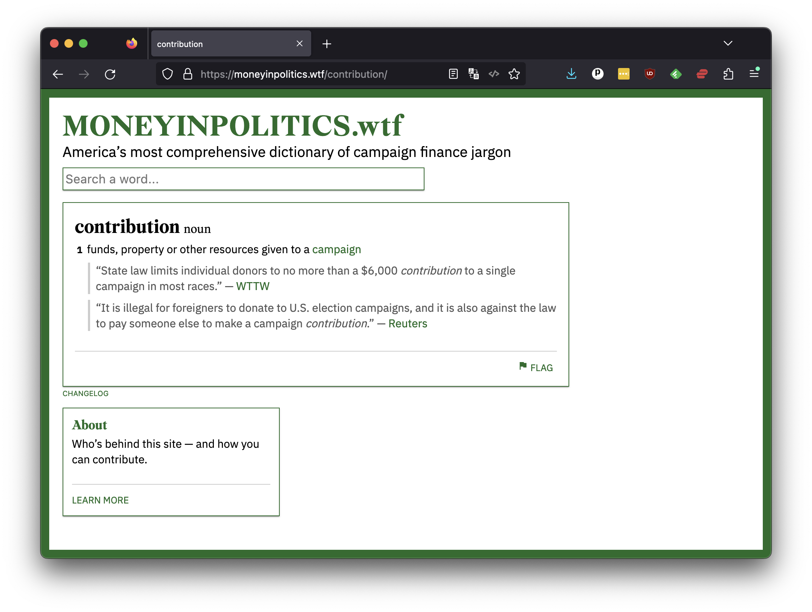

```{include} _templates/nav.html
```

# The end

Visit [cummings.ee](https://cummings.ee) in your browser and navigate to the “is 5” page.

[](https://cummings.ee/book/is-5/)

You should now see that the title of your poem includes a hyperlink. Click it. You should see the poem you transcribed published on the web.

[](https://cummings.ee/book/is-5/poem/four-ii/)

Congratulations. You've completed your first pull request.
