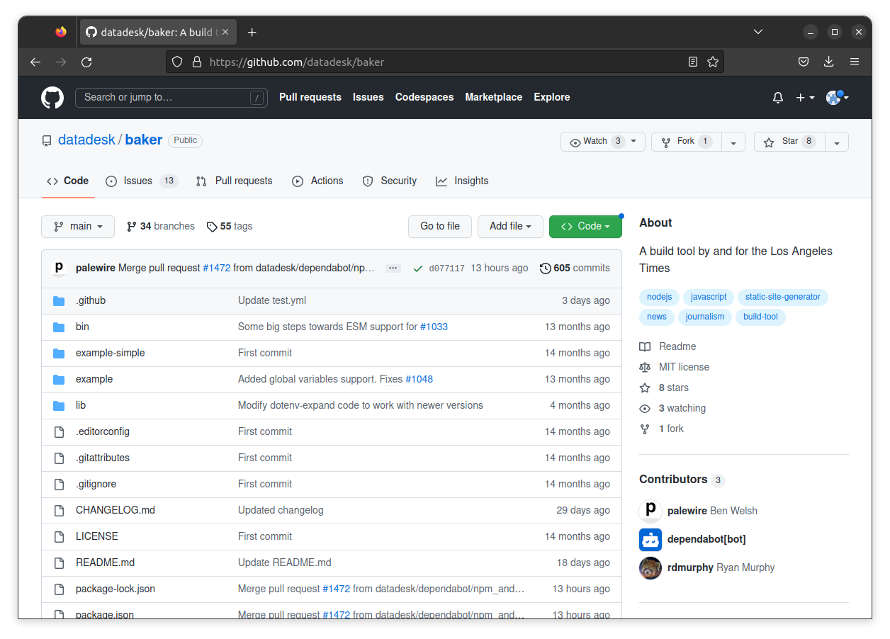
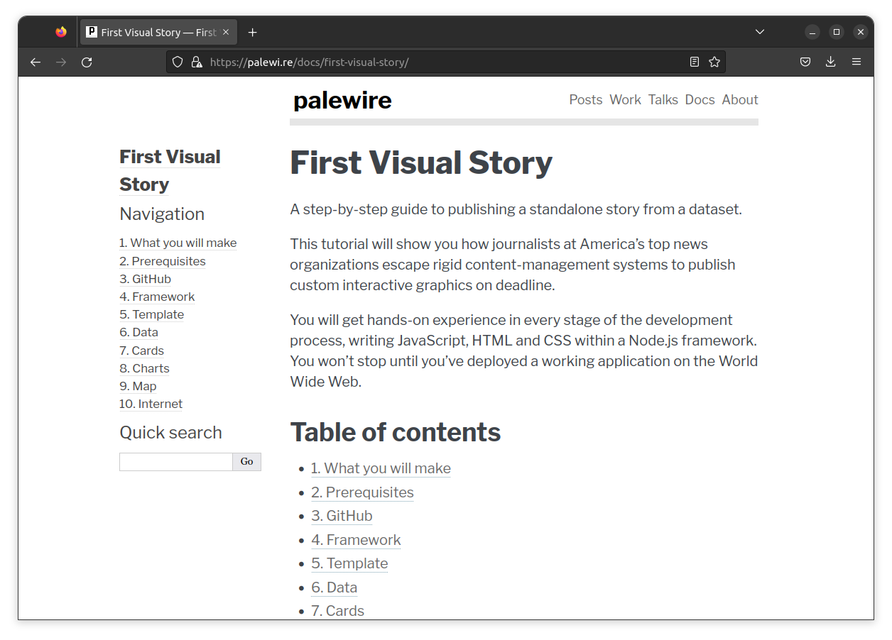

```{include} _templates/nav.html
```

## The framework

When you land on [github.com/palewire/cummings.ee](https://github.com/palewire/cummings.ee), you'll see that the repository is already populated with an array of folders and files. This is the code that powers cummings.ee by providing the HTML layout, its cosmetic style and, most important, its content.

Everything is arranged according to the specifications of a “framework.” What's that? Nothing more than fancy name for a set of software tools designed to work together. It can take dozens of different software tricks to put a website together. Frameworks aim to make the challenge easier by curating an array of tools into a simplified system that saves time, like a tool belt.

While some frameworks are more popular than others. The programming languages and the details vary. But the fundamentals are almost all the same. Others include [Django](https://en.wikipedia.org/wiki/Django_(web_framework)) or [Rails](https://en.wikipedia.org/wiki/Ruby_on_Rails) or [React](https://en.wikipedia.org/wiki/React_(JavaScript_library)).


[](https://github.com/datadesk/baker)

The cummings.ee repository is an example of a site built with [baker](https://github.com/datadesk/baker), a framework invented at the Los Angeles Times that's also used by ProPublica, THE CITY and The Baltimore Banner, among others. It is also freely available on GitHub at [github.com/datadesk/baker](https://github.com/datadesk/baker).

Baker is what is known as a static site framework. Static site frameworks allows you to build websites using only flat files, such as HTML, CSS, and JavaScript. Unlike a traditional dynamic website, which relies on a server-side language like PHP or Ruby to generate content on the fly, a static site is pre-generated and served as-is to the user. This has several benefits, including faster load times, better security and simpler deployment. Some other examples of static site frameworks are [Jekyll](https://en.wikipedia.org/wiki/Jekyll), [Gatsby](https://en.wikipedia.org/wiki/Gatsby_(JavaScript_framework)) and [Hugo](https://gohugo.io/).

[](palewi.re/docs/first-visual-story/)

This class will not cover how to build a website with baker. If you're interested in that, you should explore [“First Visual Story,”](https://palewi.re/docs/first-visual-story/) a separate tutorial that will guide you through every step of the process.

Today you will only need to navigate to the folder where poems are transcribed. We will be adding works drawn from [“is 5,”](https://cummings.ee/book/is-5/) a book of verse that was first published by Boni & Liveright in 1926. Due to the way U.S. copyright works, it entered the public domain on January 1, 2022, which allows anyone to legally republish and build off the intellectual property.

[](https://cummings.ee/book/is-5/)

At the time of this writing, only a fraction of the poems have been entered into the site. Due to the way baker has been configured in this case, the files for the book can be found in the repository's `_data/poems/is-5` folder. You should navigate there by clicking into the folders in GitHub interface or by going directly to [this URL](https://github.com/palewire/cummings.ee/tree/master/_data/poems/is-5).
