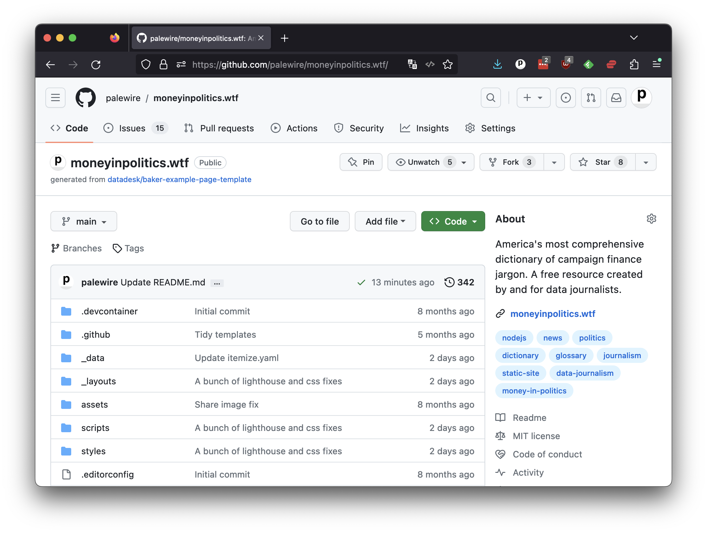
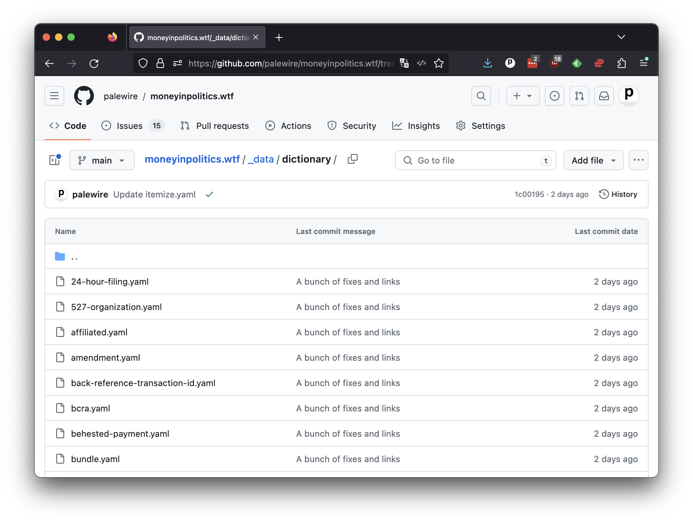

# The framework

When you land on [github.com/palewire/moneyinpolitics.wtf](https://github.com/palewire/moneyinpolitics.wtf), you'll see that the repository is already populated with an array of folders and files. This is the code that powers [moneyinpolitics.wtf](https://moneyinpolitics.wtf) by providing the HTML layout, its cosmetic style and, most important, its content.

Everything is arranged according to the specifications of the “framework” employed by the site's creators. What's a framework? Nothing more than fancy name for a set of software tools designed to work together. It can take dozens of different tricks to assemble a website. Frameworks aim to make the challenge easier by curating an array of tools into a practical arrangement, like a tool belt.

Some frameworks are more popular than others. Other examples include [Django](https://en.wikipedia.org/wiki/Django_(web_framework)) or [Rails](https://en.wikipedia.org/wiki/Ruby_on_Rails) or [React](https://en.wikipedia.org/wiki/React_(JavaScript_library)). While the programming languages and the details vary, the fundamentals are almost all the same.

The moneyinpolitics.wtf repository is an example of a site built with [baker](https://github.com/datadesk/baker), a framework invented at the Los Angeles Times. It’s also used in the ProPublica, THE CITY and The Baltimore Banner newsrooms, among others. Like moneyinpolitics.wtf, baker is freely available on GitHub at [github.com/datadesk/baker](https://github.com/datadesk/baker).

Baker is what is known as a static-site framework. Static-site frameworks allow you to build websites using only flat files, such as HTML, CSS, and JavaScript. Unlike a traditional “dynamic” website, which relies on a server-side language like PHP or Ruby to generate content on the fly, a static site is pre-generated and served as-is to the user. This has several benefits, including faster load times, better security and simpler deployment. Some other examples of static site frameworks are [Jekyll](https://en.wikipedia.org/wiki/Jekyll), [Gatsby](https://en.wikipedia.org/wiki/Gatsby_(JavaScript_framework)) and [Hugo](https://gohugo.io/).

This class will not cover how to build a website with baker. If you're interested in that, you should explore [“First Visual Story,”](https://palewi.re/docs/first-visual-story/) a separate tutorial that will guide you through every step of the process.

Today you will only need to navigate to the folder where entries in the dictionary are defined. Our goal is to add examples of campaign finance jargon in use, so that readers can better understand the terms. To do that, we will need to edit the files in the `_data/dictionary` folder.

You should navigate there by clicking into the folders in GitHub interface or by going directly to [this URL](https://github.com/palewire/moneyinpolitics.wtf/tree/main/_data/dictionary).
