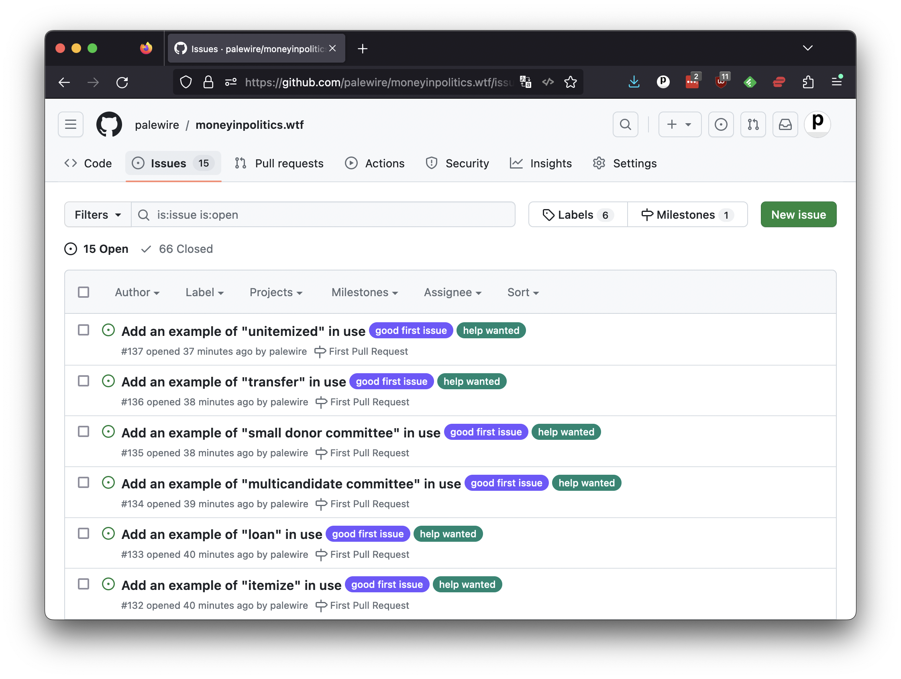

# Issues

GitHub’s issue tracker is a way to track tasks, enhancements and bugs. Each issue has its own page where you can provide details about the problem or idea, and where others can contribute to the discussion. You can use labels and milestones to organize your issues and track their progress.

Every repository has its own tracker, which you can find by clicking the "Issues" tab in the upper left. In our case, it will take you to [github.com/palewire/moneyinpolitics.wtf/issues](https://github.com/palewire/moneyinpolitics.wtf/issues). If you're interested in contributing to an open-source project, you should review the issue tracker before you dive into the code. You can find ideas for where help is needed and see if the work you're interested in has already been discussed.

As of this writing, you should see more than a dozen issues asking contributors to find and enter examples of words in use. Click on one that interests you.

In whatever ticket you choose you will find a comment with a link to the definition's YAML file. For the purposes of this demontration, I am going to choose the ticket for "contribution." 

To claim the issue, leave a comment saying you're working on it. This will signal to others that you're already addressing the task. Then click the link to the YAML file to open it on GitHub.