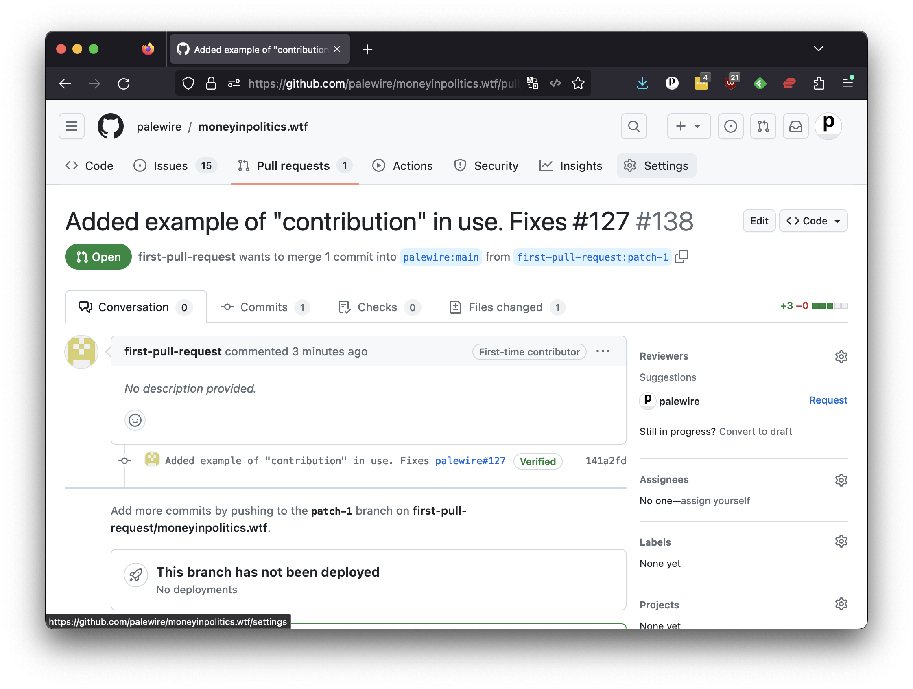

```{include} _templates/nav.html
```

# Merges

When a maintainer receives a pull request on GitHub, they should first review the changes that were proposed.

This might involve looking at the code changes themselves, as well as reading any accompanying information that the person who created the pull request provided. The maintainer will then decide whether or not to accept the changes.

This is done via the same GitHub interface you see, with greater powers granted by the owner's higher permission level. If the owner decides to accept the changes, the fork's code will be "merged" into main branch of the source repository.



Regardless of whether they decide to accept or reject the changes, the maintainer should communicate with the person who created the pull request. This could involve commenting on the pull request directly, or contacting them through other means. The goal is to provide clear and constructive feedback, and to help the person understand why the pull request was accepted or rejected.

GitHub has several code review features that are available in a pull request. They include:

* Inline comments: These allow reviewers to comment on specific lines of code, so that the person who created the pull request can see exactly where the feedback is coming from.
* Threaded conversations: These allow reviewers and contributors to have a back-and-forth discussion about the changes being proposed, without cluttering up the pull request with long lists of comments.
* Change requests: This allows reviewers to ask the person who created the pull request to make specific changes to the code, before the pull request is merged.

In the case of this project, the maintainer's chief code is to compare the quality of the transcription against the source materials. Once that hurdle has been clear, pull requests can be merged in by pressing the green "Merge pull request" button.
