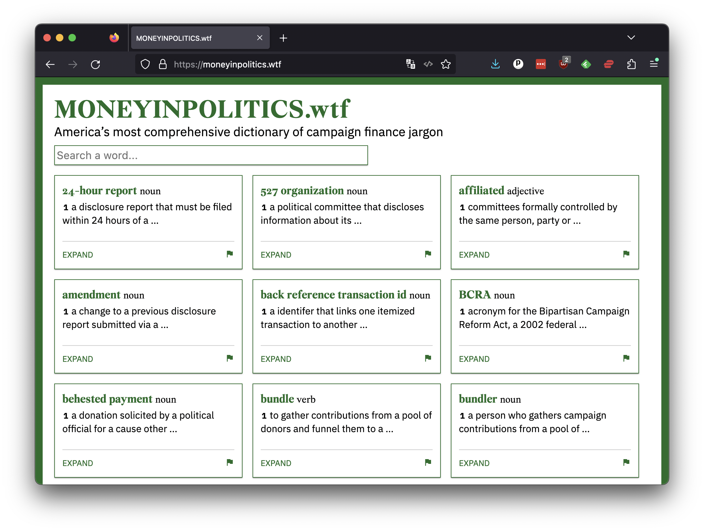

```{include} _templates/nav.html
```

# What you will do

If you complete this class, you will gain a basic understanding of how to submit an open-source software patch on [github.com](https://github.com), the leading code-management site. 

You will explore a code repository, make edits to the source and then propose your changes be included in the original project. This pattern, known as a [pull request](https://docs.github.com/en/pull-requests), is fundamental to the process that allows developers around the world to collaborate. 

[](https://moneyinpolitics.wtf)

As part of the practice, you will make a real contribution to [moneyinpolitics.wtf](https://moneyinpolitics.wtf), the in-progress, crowdsourced effort to create America's most comprehensive dictionary of campaign finance jargon.
