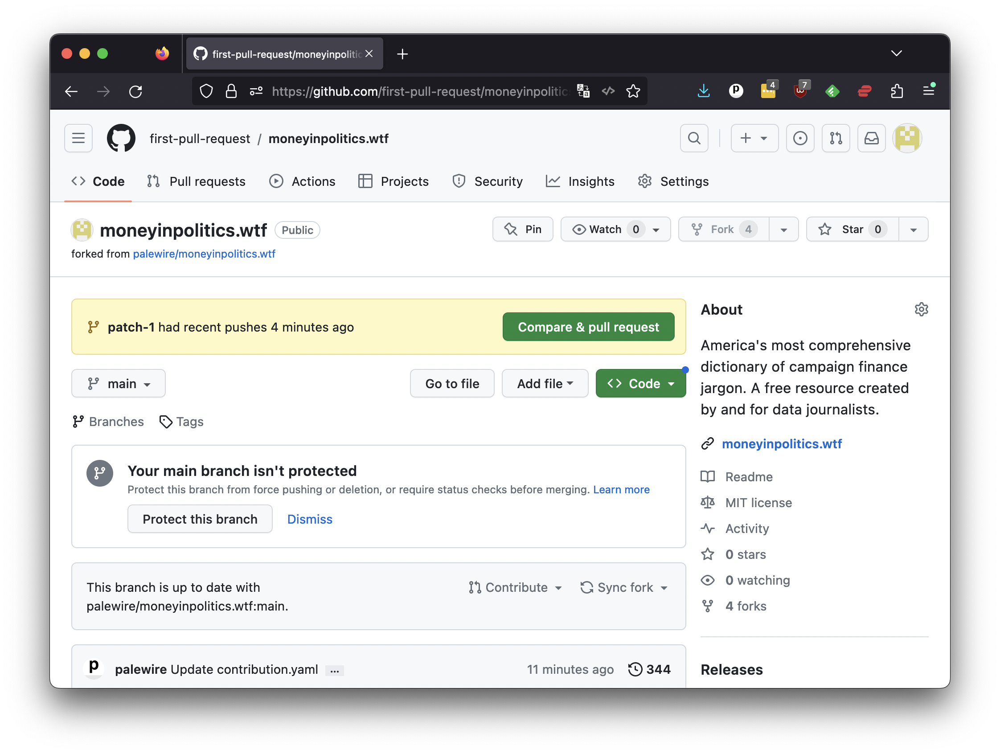

```{include} _templates/nav.html
```

# Pull requests

When you commit to a fork, GitHub presumes you're interested in proposing a change to the original repository. To make life easier, it automatically offers the opportunity to "Compare & pull request" in  a green button at the top of the page.



A pull request allows the owner of the original repository to review your changes, discuss them with you and decide whether or not to accept them. This is the most common way to collaborate on projects on GitHub.

To start the process, click the green "Compare & pull request" button.

That will bring you to a new form. You're asked to compare your changes against the original repository. You'll see a blank form, with your commit message seeded in the title box.


The larger text box below offers you the opportunity to explain your proposal. You should include enough information for the owner to understand what changes you are suggesting, and why. Here are some things you should consider including with a pull request:

* A description of the changes. This should be a high-level overview of the changes you made, and why you made them.
* Detailed information about each change you made. This could be a list of the files you changed, and a description of what you changed in each one.
* Links to any relevant issues or discussions that led to the changes you are proposing. This will help the owner of the original repository understand the context for your changes.

Overall, the more information you include with your pull request the easier it will be for the owner to understand and evaluate your changes. In cases where you don't know the maintainer or when you're making your first proposal, you should be as clear and detailed as possible. The code belongs to them, not you. Try to be polite, clear and pursuasive.

In this case, you shouldn't feel the need to explain yourself. The issue is very straightforward, as is your commit message. Simply pressing the green "Create pull request button" should be enough.

That will create a new page on the original repository and alert [Ben Welsh](https://palewi.re/who-is-ben-welsh/), the maintainer, of your proposal.


