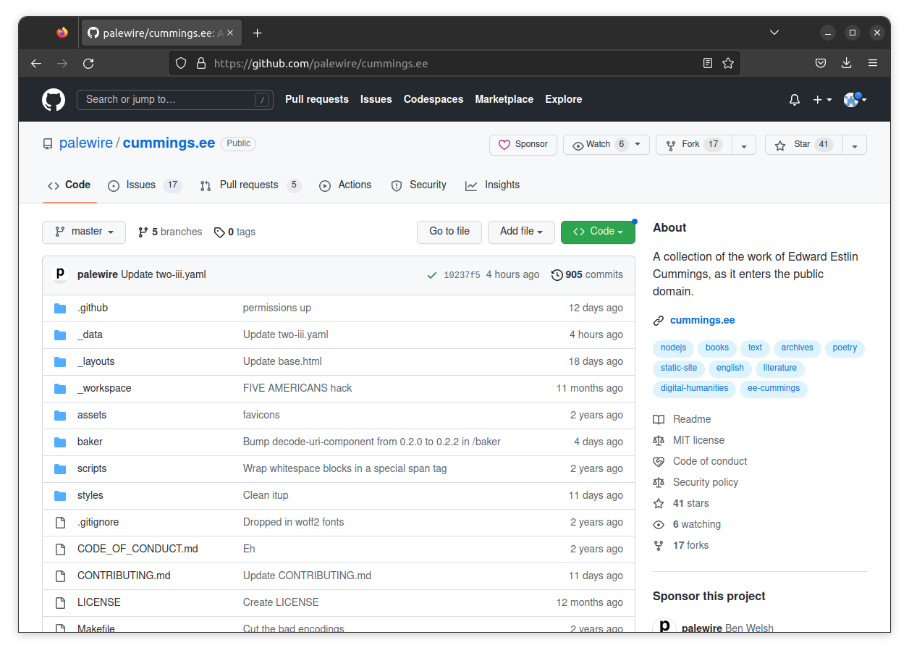

```{include} _templates/nav.html
```

# Repositories

A code repository is a place where you can store and manage your code. It's like a digital folder where you can put all the files related to a specific project, and share them with others, if you want to.

One crucial thing that makes a repository different from a traditional folder is that it employs version control, an automated technique for tracking changes to files over time. Version control allows you to carefully manage changes and roll back to previous versions if something goes wrong. That's important in computer programming because code is so brittle; A single typo can crash an entire site.

Version control also useful when working on a team or when collaborating volunteers in other locations because it allows you to see who made changes to the code, and when. It also helps you avoid conflicts when multiple people are working on the same project, because you can see exactly what changes were made and when.

[GitHub](https://en.wikipedia.org/wiki/GitHub) is, in essence, a social network built around code repositories. It is built on top of a version control system called [Git](https://en.wikipedia.org/wiki/Git), one of several popular version control programs. Currently owned by Microsoft, GitHub is the most popular service of this sort. It also offers free hosting for projects that are open to the public.

[](https://github.com/palewire/cummings.ee)

The cummings.ee website is controlled by a GitHub repository maintained by [Ben Welsh](https://palewi.re/who-is-ben-welsh/), who goes by the handle palewire. It can be found at [github.com/palewire/cummings.ee](https://github.com/palewire/cummings.ee). You should open it in a new tab before you continue. If you don't have a GitHub account already, you should [make one now](https://github.com/join).
