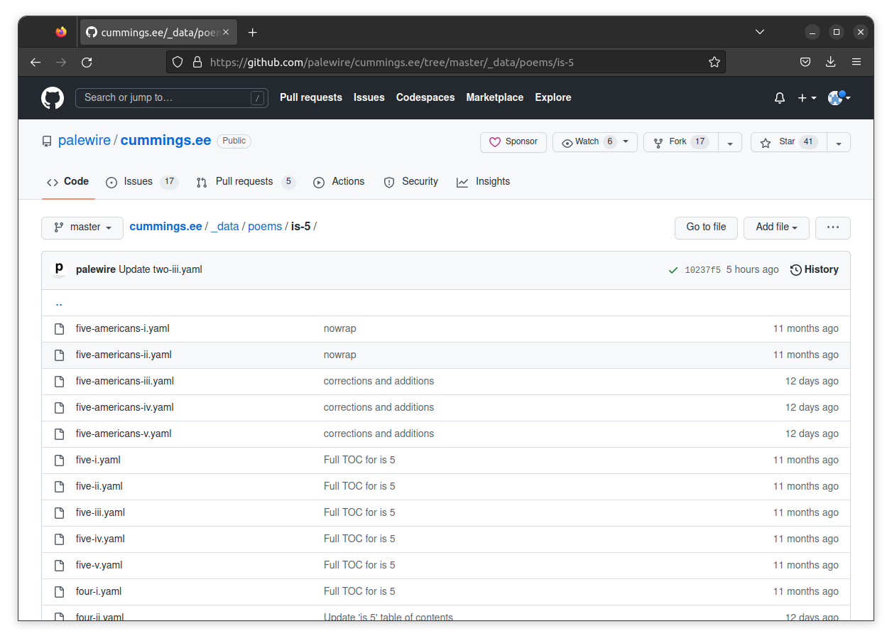
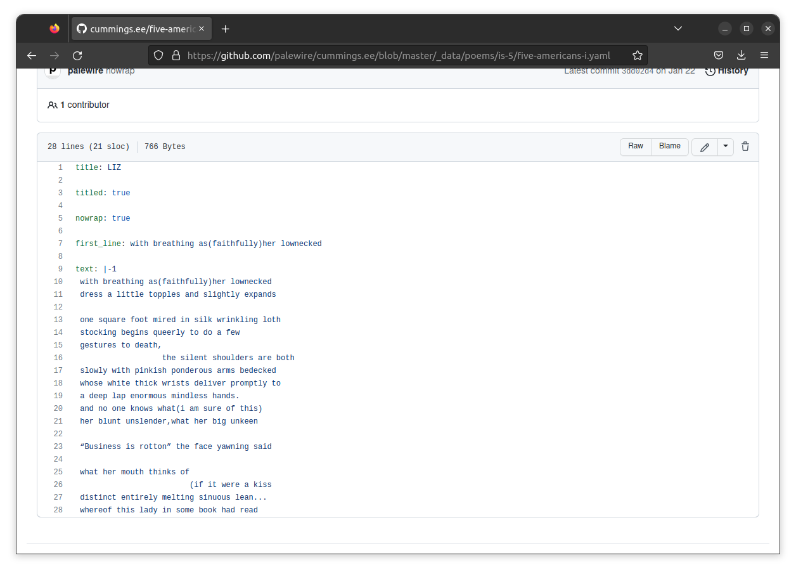
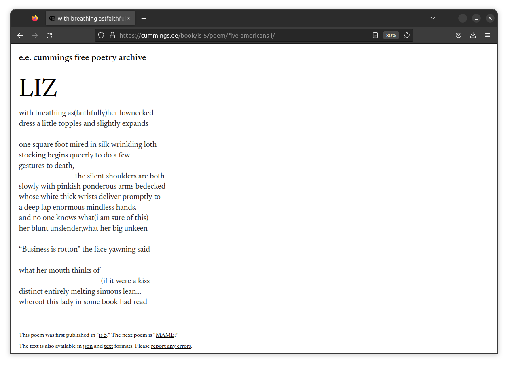

```{include} _templates/nav.html
```

# YAML

Once you've entered the [poem folder](https://github.com/palewire/cummings.ee/tree/master/_data/poems/is-5) for “is 5”, you should see a list of files. Each one aims to contain the contents of a poem, along with metadata describing it like its title.

[](https://github.com/palewire/cummings.ee/tree/master/_data/poems/is-5)

Note that each file's name ends with `.yaml`. That tells computers that the file is expected to contain data structured in YAML format.

[YAML](https://en.wikipedia.org/wiki/YAML) is a data serialization language. It is used to represent data structures in a human-readable and easy-to-write format. YAML stands for "YAML Ain't Markup Language," because it is not a markup language like HTML or XML (and because nerds like inventing [silly acronyms](https://en.wikipedia.org/wiki/Backronym).)

YAML is often used for configuration files, data storage and communication between different systems. It is a flexible and powerful language supported by many popular programming languages and tools.

Here is a simple example of a YAML file:

```yaml
# This is a comment

# This is a string
name: Alice

# This is an integer
age: 25

# This is a list
colors:
  - red
  - green
  - blue

# This is a nested object
address:
  street: 123 Main St.
  city: Anytown
  state: CA
  zip: 99999
```

The cummings.ee repository has its own custom data structure expressed in YAML. You can see an example of a fully entered poem by clicking on the first file in the list, [`five-americans-i.yaml`](https://github.com/palewire/cummings.ee/blob/master/_data/poems/is-5/five-americans-i.yaml)

[](https://github.com/palewire/cummings.ee/blob/master/_data/poems/is-5/five-americans-i.yaml)

You can see that several pieces of metadata — like the `title` and the `first_line` — are at the top. At the bottom you can see the full text of the poem, including its indentation, entered in the `text` attribute.

When the site is published, the data stored in YAML files are rendered into [an HTML template](https://github.com/palewire/cummings.ee/blob/master/_layouts/poem_detail.html) and served to the reader. You can find this poem at [cummings.ee/book/is-5/poem/five-americans-i/](https://cummings.ee/book/is-5/poem/five-americans-i/). Note that the slug at the end of the URL matches the name of the file.

[](https://cummings.ee/book/is-5/poem/five-americans-i/)

Next you will find a poem that has yet to be entered so you can offer a transcription for inclusion in the repository.
